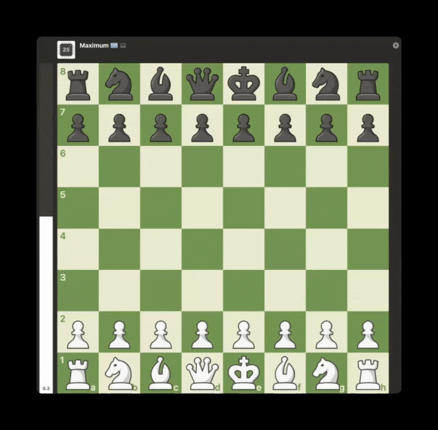

# ♟️ chess-grandmaster

A [Claude Code](https://claude.com/claude-code) skill that plays — and wins —
chess on [chess.com](https://www.chess.com) at grandmaster strength, by driving
the browser with Playwright and choosing every move with the
[Stockfish](https://stockfishchess.org/) engine.

> **Why I built this (the honest version):** Pure curiosity. After watching a
> bunch of YouTube videos of ChatGPT and other AI tools playing hilariously bad
> chess — hanging pieces, making illegal moves, losing to total beginners — I
> wondered: if you stopped asking the model to "think" and instead handed it a
> real engine, would it actually win? Turns out, yes. Emphatically. This was a
> weekend experiment, not a serious tool.

## How it works

Large language models are *bad* at chess. They try to hold the board in their
head, hallucinate piece positions, and miss one-move tactics — which is why a
strong model can lose to even the weakest bots. The fix isn't a cleverer prompt;
it's architecture:

> **Claude is the hands and eyes. Stockfish is the brain.**

Claude never decides a chess move itself. Each turn it reads the position off the
page, hands it to Stockfish, and plays back the engine's choice. That single
design decision is the whole skill.

```
chess.com board
   │  read the DOM → FEN + move history          (read_board*.js)
   ▼
Stockfish (depth/time-limited)                    (bestmove.py)
   │  best move in UCI, e.g. e2e4
   ▼
real Playwright mouse clicks at square centers    (play_move.js)
   │
   ▼  move played, opponent's reply captured
```

## Track record

Live games against chess.com bots — engine-backed skill vs. the bot:

| # | Opponent | Bot rating | We played | Result | Our accuracy | Bot accuracy |
|---|----------|-----------|-----------|--------|--------------|--------------|
| 1 | Martin | 250 | White | ✅ Mate in 18 | — | — |
| 2 | Maximum (Komodo) | 3200 | White | ✅ Mate in 58 | — | — |
| 3 | Maximum (Komodo) | 3200 | Black | ✅ Mate in 55 | **99.1%** | 88.4% |

**Record vs Komodo "Maximum" (3200): 2–0–0.**

Beating a 3200 bot is the headline — that opponent is itself an engine, so these
are genuine engine-vs-engine wins, not just "crushes weak bots." Game 3 is the
standout: playing **Black**, the skill scored **99.1% accuracy** with **1
Brilliant** move (`Re3!!`) and **zero blunders** — chess.com graded the play at
**2600**, versus the 3200 bot's **88.4% / 2050** (it blundered). The engine
out-accuracied its own rating tier.



*The entire game against the 3200 bot — opening to **Rh8#** (1-0). 1 Brilliant, 33 Best, 14 Excellent moves.*

## Requirements

- [Claude Code](https://claude.com/claude-code) with a Playwright MCP server
  available (for browser automation).
- [Stockfish](https://stockfishchess.org/) — `brew install stockfish`
- [python-chess](https://python-chess.readthedocs.io/) — `pip install chess`

The skill checks for these and installs the missing ones on first run.

## Install

Clone into your Claude Code skills directory:

```bash
git clone https://github.com/umzcio/claude-chess-grandmaster.git \
  ~/.claude/skills/chess-grandmaster
```

Then in Claude Code just ask it to play — e.g. *"play Martin on chess.com"* or
*"beat the computer on chess.com"*. The skill opens the board, pauses for you to
log in / pick the bot if needed, and takes over, narrating each move.

> **Fair play:** this is for chess.com **bots only** (unrated — engine help is
> allowed). Do not use it against human opponents; chess.com bans engine
> assistance in rated games.

## What's in here

| File | Role |
| --- | --- |
| `SKILL.md` | The skill: setup, the move loop, and how to drive the board. |
| `scripts/bestmove.py` | The brain — position in, Stockfish's best move out. Deterministic. |
| `scripts/play_move.js` | Executes a move with real Playwright mouse clicks; returns the reply. |
| `scripts/read_board.js` | Reads the live chess.com position into a FEN. |
| `scripts/read_board_min.js` | Compact board reader installed on `window` for fast per-move reads. |
| `scripts/selftest.py` | Regression test for the brain — finds mates, handles promotion/castling/en passant. No browser needed. |

## Testing the brain

The engine layer is fully testable without a browser:

```bash
python3 scripts/selftest.py
# 9 passed, 0 failed
```

## How the move-making actually works

The non-obvious part: chess.com routes all input through a single
`<wc-chess-board>` web component that sits on top of the pieces and **ignores
synthetic JS events**. Clicking piece/hint elements via the accessibility tree
fails. What works is issuing *real* Playwright mouse clicks
(`page.mouse.click(x, y)`) at the pixel center of each square — trusted input the
board accepts. Square centers are derived from the board's bounding rect and
orientation (the board carries a `.flipped` class when you play Black).

## License

MIT — see [LICENSE](LICENSE).

---

🤖 Built with [Claude Code](https://claude.com/claude-code).
